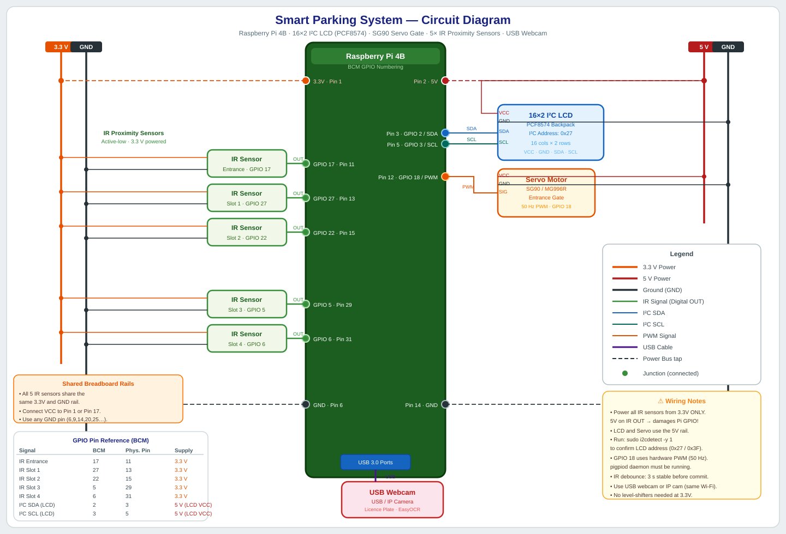

# Smart Parking System

A modular, Raspberry Pi 4B–based Smart Parking System designed for a mall environment. The system uses **Automatic Licence Plate Recognition (ALPR)** via EasyOCR, five IR proximity sensors for entry detection and slot occupancy, a servo-controlled gate, and a 16×2 I2C LCD to automate vehicle entry, slot allocation, exit detection, and dynamic billing.

---

## Table of Contents

1. [Project Overview](#project-overview)
2. [Circuit Diagram](#circuit-diagram)
3. [Hardware Requirements](#hardware-requirements)
4. [Master Wiring Guide](#master-wiring-guide)
5. [Camera Configuration](#camera-configuration)
6. [Software Setup](#software-setup)
7. [Repository File Structure](#repository-file-structure)
8. [Core Logic Flow](#core-logic-flow)
9. [Dynamic Pricing](#dynamic-pricing)
10. [database.json Schema](#databasejson-schema)

---

## Circuit Diagram

The file [`circuit_diagram.svg`](circuit_diagram.svg) contains a full visual schematic of all hardware connections.



**What the diagram shows:**

| Layer | Detail |
|---|---|
| **Power buses** | Left-side 3.3 V bus (orange) and GND bus (black) feed all five IR sensors. Right-side 5 V bus (red) and GND bus (black) feed the LCD and servo. |
| **IR Proximity Sensors** | Five modules (Entrance + Slots 1–4) — each has VCC → 3.3 V, GND → GND rail, and OUT → the corresponding BCM GPIO pin. |
| **16×2 I²C LCD** | VCC → 5 V; GND → GND; SDA → GPIO 2 (Pin 3); SCL → GPIO 3 (Pin 5). |
| **Servo Motor** | VCC → 5 V; GND → GND; Signal → GPIO 18 / hardware PWM (Pin 12). |
| **USB Webcam** | Connected via USB for licence-plate capture (EasyOCR). |

> Open `circuit_diagram.svg` in any modern web browser or SVG viewer for the full interactive diagram.

---


The Smart Parking System automates the complete vehicle lifecycle inside a mall car park:

- **Entry detection** — An IR sensor at the entrance detects an approaching vehicle and triggers the ALPR pipeline.
- **Licence Plate Recognition** — `vision.py` captures a frame from a USB webcam or mobile IP camera, pre-processes it with OpenCV (grayscale → bilateral filter → adaptive threshold), and extracts the plate string with EasyOCR.  If recognition fails the system returns `None` and resets; there is no QR-code fallback.
- **Slot allocation** — `main.py` finds the lowest-numbered free slot (tracked by four IR occupancy sensors with 3-second software debounce) and records `{plate_id, entry_time, slot}` in `database.json`.
- **Gate control** — A servo motor opens the gate for 5 seconds, then closes it automatically.
- **Exit & billing** — When a slot sensor transitions from Occupied → Free, `billing.py` calculates the charge using dynamic peak/off-peak rates and prints the bill to the terminal.

### Dynamic Pricing

| Time Window | Rate |
|---|---|
| Off-peak (all hours outside 17:00–22:00) | **Rs. 50 / hour** |
| Peak hours (17:00–22:00 daily) | **Rs. 75 / hour** |

Partial hours are billed per-minute. The billing engine splits the parked duration across rate windows automatically.

---

## Hardware Requirements

### Active Components

| Qty | Component | Purpose |
|-----|-----------|---------|
| 1 | Raspberry Pi 4B (2 GB RAM or above) | Central controller |
| 1 | 16×2 I2C LCD Display (PCF8574 backpack) | User-facing status messages |
| 1 | Standard Servo Motor (SG90 or MG996R) | Automated entrance gate |
| 5 | IR Proximity Sensor Module (digital OUT) | 1× entrance trigger + 4× slot occupancy |
| 1 | USB Webcam **or** Mobile Phone (IP Webcam app) | Licence plate capture |
| 1 | Breadboard + Jumper Wires | Prototyping connections |
| 1 | 5 V / 3 A USB-C Power Supply | Powers the Pi |
| 1 | Servo external 5 V supply *(optional)* | Prevents Pi brownout under servo load |

### ~~Removed Components (no longer used)~~

> ⚠️ **The following components from previous hardware revisions are NO LONGER part of this build.  Do NOT connect them.**
>
> | Removed Component | Reason |
> |---|---|
> | ~~HC-SR04 Ultrasonic Sensors~~ | Replaced entirely by IR sensors for all detection tasks |
> | ~~Raspberry Pi Camera Module v2 (CSI)~~ | Replaced by an external USB webcam or IP camera |
> | ~~1 kΩ / 2 kΩ Resistors (voltage divider)~~ | Only required for HC-SR04 Echo pins — no longer needed |

---

## Master Wiring Guide

All GPIO numbers use the **BCM (Broadcom)** scheme.

### GPIO Pin Assignment

| Signal | BCM GPIO | Physical Pin | Direction | Supply Rail |
|---|---|---|---|---|
| I2C SDA — LCD | GPIO 2 | Pin 3 | Bidirectional | — |
| I2C SCL — LCD | GPIO 3 | Pin 5 | Bidirectional | — |
| Servo PWM | GPIO 18 | Pin 12 | Output | **5 V rail** |
| IR Sensor — Entrance | GPIO 17 | Pin 11 | Input | **3.3 V rail** |
| IR Sensor — Slot 1 | GPIO 27 | Pin 13 | Input | **3.3 V rail** |
| IR Sensor — Slot 2 | GPIO 22 | Pin 15 | Input | **3.3 V rail** |
| IR Sensor — Slot 3 | GPIO 5 | Pin 29 | Input | **3.3 V rail** |
| IR Sensor — Slot 4 | GPIO 6 | Pin 31 | Input | **3.3 V rail** |

> **Tip:** All GND pins on the 40-pin header are equivalent.  Use Pins 6, 9, 14, 20, 25, 30, 34, or 39 to build a shared ground rail on the breadboard.

---

### ⚠️ Critical Voltage Warning — IR Sensors vs Servo & LCD

> **READ THIS BEFORE WIRING ANYTHING**
>
> The Raspberry Pi 4B's GPIO input pins are rated for a **maximum of 3.3 V**.  Applying 5 V directly to any GPIO pin **will permanently destroy** the Pi's SoC.
>
> **Rule of thumb for this build:**
>
> | Component | VCC Supply | Why |
> |---|---|---|
> | 16×2 I2C LCD (PCF8574 backpack) | **5 V rail** (Pin 2 or Pin 4) | The LCD backlight and logic require 5 V; the PCF8574 I2C lines are open-drain and 3.3 V tolerant. |
> | Servo Motor (SG90 / MG996R) | **5 V rail** (Pin 2 or Pin 4) | Servo logic and motor both run at 5 V. |
> | **All 5 × IR Sensor Modules** | **3.3 V rail** (Pin 1 or Pin 17) | When powered from 3.3 V, the digital OUT pin also swings to 3.3 V, making it GPIO-safe with no additional components needed.  **If you power an IR module from 5 V, its OUT pin will output 5 V and will damage the Pi.** |

---

### Component Wiring Tables

#### 16×2 I2C LCD (PCF8574 Backpack)

```
LCD Backpack Pin  →  Raspberry Pi
─────────────────────────────────
VCC               →  5 V rail  (Pin 2 or Pin 4)
GND               →  GND rail
SDA               →  GPIO 2   (Pin 3)
SCL               →  GPIO 3   (Pin 5)
```

> Run `sudo i2cdetect -y 1` after wiring to confirm the I2C address (typically `0x27`).
> Update `LCD_I2C_ADDRESS` in `hardware.py` if your module shows `0x3F` or another address.

---

#### Servo Motor (Gate)

```
Servo Wire    →  Connection
───────────────────────────
Brown / Black →  GND rail
Red           →  5 V rail  (Pin 2 or Pin 4)
Orange / White→  GPIO 18   (Pin 12)  — Hardware PWM via pigpio
```

> `hardware.py` uses **pigpio** to generate Hardware PWM on GPIO 18 for jitter-free servo control.
> The `pigpiod` daemon must be running before starting the application.

---

#### IR Sensors — All Five (Entrance + Slots 1–4)

> ⚠️ **Power all IR sensors from the 3.3 V rail.  Never use the 5 V rail.**

```
IR Module Pin  →  Raspberry Pi
──────────────────────────────────────────────────────
VCC            →  3.3 V rail  (Pin 1 or Pin 17)   ← MUST be 3.3 V
GND            →  GND rail
OUT (Entrance) →  GPIO 17  (Pin 11)
OUT (Slot 1)   →  GPIO 27  (Pin 13)
OUT (Slot 2)   →  GPIO 22  (Pin 15)
OUT (Slot 3)   →  GPIO 5   (Pin 29)
OUT (Slot 4)   →  GPIO 6   (Pin 31)
```

Each IR module shares the same 3.3 V and GND rails on the breadboard; only the OUT wire is unique per sensor.

---

#### Quick-Reference Pin Diagram

```
Raspberry Pi 4B — 40-pin header (BCM numbering)
─────────────────────────────────────────────────────────────
 3.3 V  [Pin  1] ──► IR VCC rail     [ Pin  2] 5 V ──► Servo + LCD VCC
 GPIO2  [Pin  3] ◄──► LCD SDA        [ Pin  4] 5 V
 GPIO3  [Pin  5] ◄──► LCD SCL        [ Pin  6] GND ──► shared GND rail
         ...
 GPIO17 [Pin 11] ◄── IR Entrance OUT [Pin 12 ] GPIO18 ──► Servo PWM
 GPIO27 [Pin 13] ◄── IR Slot 1 OUT   [Pin 14 ] GND
 GPIO22 [Pin 15] ◄── IR Slot 2 OUT   [Pin 16 ] —
         ...
 GPIO5  [Pin 29] ◄── IR Slot 3 OUT   [Pin 30 ] GND
 GPIO6  [Pin 31] ◄── IR Slot 4 OUT   [Pin 32 ] —
─────────────────────────────────────────────────────────────
```

---

## Camera Configuration

`vision.py` uses `cv2.VideoCapture` to open the camera.  No CSI ribbon cable or `picamera2` library is required.  Choose the option that matches your setup:

### Option A — USB Webcam

Plug the webcam into any USB port on the Pi.  In `vision.py`, the capture index defaults to `0` (first USB camera detected by the OS):

```python
cap = cv2.VideoCapture(0)
```

If you have multiple USB devices, try index `1`, `2`, etc., or use the device path directly:

```python
cap = cv2.VideoCapture("/dev/video0")
```

### Option B — Mobile Phone IP Camera (IP Webcam)

1. Install the **IP Webcam** app on your Android phone (or any RTSP streaming app on iOS/Android).
2. Start the server in the app and note the URL displayed on-screen (e.g. `http://192.168.1.42:8080/video`).
3. In `vision.py`, replace the capture argument with the full stream URL:

```python
cap = cv2.VideoCapture("http://192.168.1.42:8080/video")
```

> **Tip:** Ensure the Pi and the phone are connected to the **same Wi-Fi network**.  For best ALPR results, position the camera so the licence plate fills at least 25% of the frame width and is well-lit.

---

## Software Setup

### Prerequisites

- Raspberry Pi OS (64-bit Lite or Desktop) — **Bullseye or Bookworm**
- Python 3.9 or newer
- Internet connection for initial package installation

---

### Step 1 — Enable I2C

Run `sudo raspi-config` and enable:

1. **Interface Options → I2C** (required for the LCD)
2. **Interface Options → SSH** *(recommended for headless operation)*

Reboot after making changes:

```bash
sudo reboot
```

---

### Step 2 — System-Level Dependencies

```bash
# Refresh package index and upgrade existing packages
sudo apt update && sudo apt upgrade -y

# pigpio daemon — Hardware PWM for the servo
sudo apt install -y pigpio python3-pigpio

# I2C tools — used to scan for the LCD I2C address
sudo apt install -y i2c-tools

# OpenCV system libraries
sudo apt install -y libopencv-dev

# EasyOCR / PyTorch native math libraries
sudo apt install -y libatlas-base-dev libopenblas-dev
```

Enable the pigpio daemon to start automatically on boot:

```bash
sudo systemctl enable pigpiod
sudo systemctl start pigpiod
```

Confirm the LCD is detected on the I2C bus:

```bash
sudo i2cdetect -y 1
# A device address (e.g. 27 or 3f) should appear in the grid.
```

---

### Step 3 — Python Dependencies

```bash
# Create and activate a virtual environment (strongly recommended)
python3 -m venv .venv
source .venv/bin/activate

# Core dependencies
pip install --upgrade pip
pip install RPi.GPIO          # GPIO control for IR sensors
pip install pigpio            # Hardware PWM for servo
pip install RPLCD             # I2C LCD driver (PCF8574 backpack)

# Computer vision & ALPR
pip install opencv-python     # OpenCV for frame capture and preprocessing
pip install easyocr           # EasyOCR for licence plate text extraction
```

> **Note on install time:** `easyocr` depends on PyTorch, which is a large package (~500 MB wheel on ARM).  On a Raspberry Pi 4B, `pip install easyocr` can take **15–25 minutes**.  Ensure a stable internet connection and consider using a swap file if you encounter memory errors during installation:
>
> ```bash
> sudo dphys-swapfile swapoff
> sudo sed -i 's/CONF_SWAPSIZE=.*/CONF_SWAPSIZE=2048/' /etc/dphys-swapfile
> sudo dphys-swapfile setup && sudo dphys-swapfile swapon
> ```

---

### Step 4 — Run the System

```bash
# Make sure the pigpio daemon is running
sudo systemctl start pigpiod

# Activate the virtual environment
source .venv/bin/activate

# Start the parking system
python main.py
```

#### Optional — Run as a systemd Service (auto-start on boot)

Create `/etc/systemd/system/parking.service`:

```ini
[Unit]
Description=Smart Parking System
After=pigpiod.service network.target
Requires=pigpiod.service

[Service]
ExecStart=/home/pi/Smart-Parking-System/.venv/bin/python /home/pi/Smart-Parking-System/main.py
WorkingDirectory=/home/pi/Smart-Parking-System
Restart=on-failure
User=pi

[Install]
WantedBy=multi-user.target
```

```bash
sudo systemctl daemon-reload
sudo systemctl enable parking.service
sudo systemctl start parking.service
```

---

## Repository File Structure

```
Smart-Parking-System/
├── main.py           # State machine & main control loop
├── hardware.py       # GPIO abstractions: Servo, IR sensors (debounced), I2C LCD
├── vision.py         # ALPR: OpenCV preprocessing → EasyOCR; returns None on failure
├── billing.py        # Entry/exit time tracking & dynamic cost calculation
├── database.json     # Local JSON store for active parked vehicles
└── README.md         # This file
```

---

## Core Logic Flow

```
┌─────────────────────────────────────────────────────────────────────┐
│  STATE: IDLE                                                        │
│  LCD: "Welcome!  Slots: X/4"                                        │
│  Loop: poll IR entrance sensor (debounced)                          │
└───────────────────────────┬─────────────────────────────────────────┘
                            │  Entrance IR sensor: Occupied (≥ 3 s stable)
                            ▼
┌─────────────────────────────────────────────────────────────────────┐
│  STATE: TRIGGERED                                                   │
│  LCD: "Please wait..."                                              │
└───────────────────────────┬─────────────────────────────────────────┘
                            │
              ┌─────────────▼─────────────┐
              │   Capacity Check          │
              │   Poll IR Slots 1–4       │
              └───────┬───────────────────┘
                      │ All 4 slots occupied?
             Yes ◄────┤
              │       │ No
              ▼       ▼
   LCD: "Sorry,  ┌─────────────────────────────────────────────────────┐
   Lot Full"     │  STATE: SCANNING                                    │
   → IDLE RESET  │  Capture frame from USB/IP camera (cv2)            │
                 │  Preprocess: grayscale → bilateral → threshold     │
                 │  Run EasyOCR → confidence filter → plate regex     │
                 │  If OCR returns None → reset to IDLE               │
                 └───────────────────────┬─────────────────────────────┘
                                         │ plate_id obtained
                                         ▼
                 ┌─────────────────────────────────────────────────────┐
                 │  STATE: ENTRY & ALLOCATION                          │
                 │  Find lowest free slot (1–4)                       │
                 │  Write {plate_id, entry_time, slot} → database.json│
                 │  LCD: "Welcome [Plate] / Slot [X]"                 │
                 │  Open servo gate → hold 5 s → close gate           │
                 └───────────────────────┬─────────────────────────────┘
                                         │
                                         ▼
                 ┌─────────────────────────────────────────────────────┐
                 │  STATE: MONITORING (background thread)              │
                 │  Poll all 4 slot IR sensors continuously           │
                 │  Each sensor: must hold new state ≥ 3 s to commit  │
                 └───────────────────────┬─────────────────────────────┘
                                         │ Slot IR sensor: Occupied → Free
                                         ▼
                 ┌─────────────────────────────────────────────────────┐
                 │  STATE: EXIT & BILLING                              │
                 │  Retrieve entry_time + slot from database.json     │
                 │  Split duration across peak / off-peak windows     │
                 │  Print itemised bill to terminal                   │
                 │  Remove vehicle record from database.json          │
                 │  Update LCD: "Welcome!  Slots: X/4"                │
                 └─────────────────────────────────────────────────────┘
```

---

## Dynamic Pricing

| Time Period | Rate |
|---|---|
| Off-peak (all hours outside 17:00–22:00) | **Rs. 50 / hour** |
| Peak hours (17:00–22:00) | **Rs. 75 / hour** |

The billing engine (`billing.py`) splits the parked duration across rate windows and charges each segment proportionally.  Partial hours are billed per-minute.

**Example (same-day, crosses the peak boundary):**

```
Entry:  2026-04-15 16:30
Exit:   2026-04-15 18:45
Total:  2 h 15 min

Off-peak segment:  16:30 → 17:00  =  30 min  →  Rs. 50/hr  →  Rs.  25.00
Peak segment:      17:00 → 18:45  =  1h 45m  →  Rs. 75/hr  →  Rs. 131.25
                                                               ──────────
                                                  Total Bill:  Rs. 156.25
```

---

## database.json Schema

The file is created automatically on first run if it does not exist.

```json
{
  "<plate_id>": {
    "entry_time": "<ISO-8601 timestamp>",
    "slot": "<integer 1–4>"
  }
}
```

**Example populated state:**

```json
{
  "MH12AB1234": {
    "entry_time": "2026-04-15T17:30:00",
    "slot": 2
  },
  "KA05XY9988": {
    "entry_time": "2026-04-15T18:05:00",
    "slot": 1
  }
}
```

An **empty object `{}`** indicates no vehicles are currently parked (lot is fully vacant).
